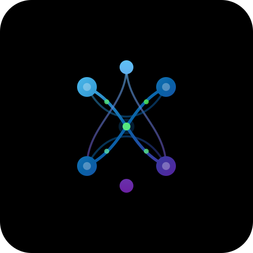

<p align="center">
  
</p>

<h1 align="center">NestWeaver</h1>

<p align="center">
  Code knowledge graph for AI agents
</p>

---

NestWeaver builds structural knowledge graphs of codebases for AI agents. It
parses source files across multiple languages, resolves cross-file references
with confidence scoring, and exposes the result through a CLI that returns
precomputed, structured answers. Agents query symbols, dependencies, and call
graphs without reading raw source.

## Install

### From source

Requires Rust 1.85+ (edition 2024).

```sh
cargo install --path .
```

Or build without installing:

```sh
cargo build --release
# Binary at ./target/release/nestweaver
```

### Pre-built binaries

Download from [GitHub Releases](https://github.com/korykehl/nestweaver/releases)
for Linux and macOS (x86_64 and aarch64).

## Quick Start

```sh
# Index a repository (creates ./nestweaver.lbug by default)
nestweaver index --repo ./my-project

# Get task-focused context — only symbols relevant to your work
nestweaver context processPayment CheckoutService

# Search for symbols
nestweaver search "UserService"

# Look up a symbol — shows signature, callers, callees
nestweaver symbol "UserService"

# Blast-radius analysis — what depends on this symbol?
nestweaver impact "processPayment" --depth 3

# Ranked structural skeleton sized for an AI context window
nestweaver repo-map --token-budget 2000
```

All commands support `--json` for machine-readable output. Use `--db <path>` to
specify a database file other than the default `./nestweaver.lbug`.

### Example output

```
$ nestweaver context greet

Seeds (1 resolved):
  greet  Function  src/helper.js:1

Connected (1 symbols, ranked by relevance):
  formatGreeting  Function  src/helper.js:5  0.44
```

```
$ nestweaver symbol greet

Symbol: greet
Kind: Function
File: src/helper.js:1
Signature: function greet(name) {

Callees (1):
  formatGreeting (src/helper.js:5)
```

```
$ nestweaver repo-map --token-budget 200

src/main.js
  Function function main() {
  Class class Application {
    Method run() {
src/helper.js
  Function function greet(name) {
  Function function formatGreeting(name) {
```

## Languages

JavaScript, TypeScript, Java, Go, Python, C, C++, Rust, C#, Kotlin, PHP, Ruby,
Dart, Swift, COBOL. Markdown files are also parsed for cross-references and
structure.

## CLI Reference

Run `nestweaver --help` for the full command list, or `nestweaver <command> --help`
for details on any subcommand.

| Command | Description |
|---------|-------------|
| `index` | Index a local repository into the code graph |
| `context` | Task-focused subgraph — relevant symbols for given seeds via Personalized PageRank |
| `search` | Search symbols by name substring |
| `symbol` | Look up a symbol by name or UID (signature, callers, callees) |
| `impact` | Analyze blast radius of a symbol change |
| `repo-map` | Generate a ranked structural skeleton within a token budget |
| `list-repos` | List all indexed repositories |
| `list-services` | List all services/modules |
| `service-summary` | Show a service summary with entry points |
| `cross-repo-refs` | Show cross-repo references for a symbol |
| `suggest-links` | Analyze indexed repos and suggest cross-repo links and features |
| `list-links` | Display declared cross-repo links from instance config |
| `list-features` | Display declared feature bundles from instance config |
| `pull` | Pull repository source on demand |
| `instance` | Manage NestWeaver instances (register, list, remove, pull) |
| `snapshot` | Manage graph snapshots (build, verify, push) |

## Architecture

Cargo workspace with 8 internal crates compiling to a single static binary:

| Crate | Purpose |
|-------|---------|
| `nestweaver-schema` | Node/edge types, UIDs, confidence scoring, schema versioning |
| `nestweaver-parser` | Tree-sitter + regex parsing for 16 languages |
| `nestweaver-resolver` | Cross-file symbol resolution with import graphs |
| `nestweaver-store` | LadybugDB graph store, PageRank, hybrid search |
| `nestweaver-storage` | Pluggable snapshot storage backends (local, S3, GitLab) |
| `nestweaver-engine` | Indexing pipeline, query dispatch, config, snapshots, LLM integration |
| `nestweaver-mcp` | Optional MCP server for non-shell AI clients |
| `nestweaver-web` | Optional web UI and API backend |

## Multi-Repo & Instance Config

For projects with multiple repos, NestWeaver supports cross-repo links and
feature bundles. See the [Instance Config Guide](docs/guide/instance-config.md)
for setup, examples, and the full config reference. See `examples/` for
a complete instance config and sample manifest files for each supported format.

```sh
# Let NestWeaver suggest how your repos relate
# Manifest deps (package.json, go.mod, Cargo.toml, pyproject.toml, composer.json, Gemfile, pubspec.yaml, Package.swift, *.csproj, build.gradle.kts, CMakeLists.txt) are detected automatically
nestweaver suggest-links --db ./all-repos.lbug

# View declared links and features from instance config
nestweaver list-links --config ./nestweaver-instance.toml
nestweaver list-features --config ./nestweaver-instance.toml

# Query by feature across repos
nestweaver context --feature device-pairing --config ./nestweaver-instance.toml --db ./all-repos.lbug
```

## Contributing

See [CONTRIBUTING.md](CONTRIBUTING.md) for commit conventions, dev commands, and
how to submit changes.

## License

MIT

---

<p align="center">
  <sub>Built by <a href="https://kehl.io">kehl.io</a></sub>
</p>
