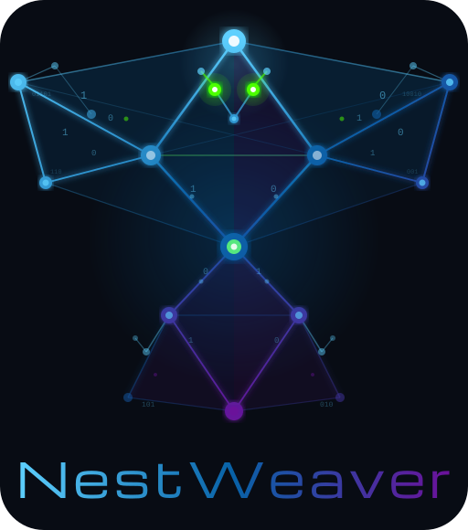
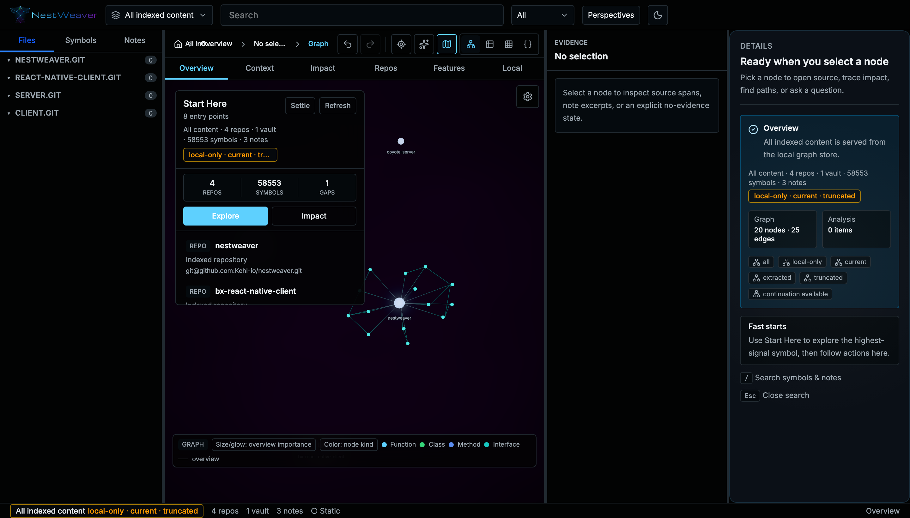
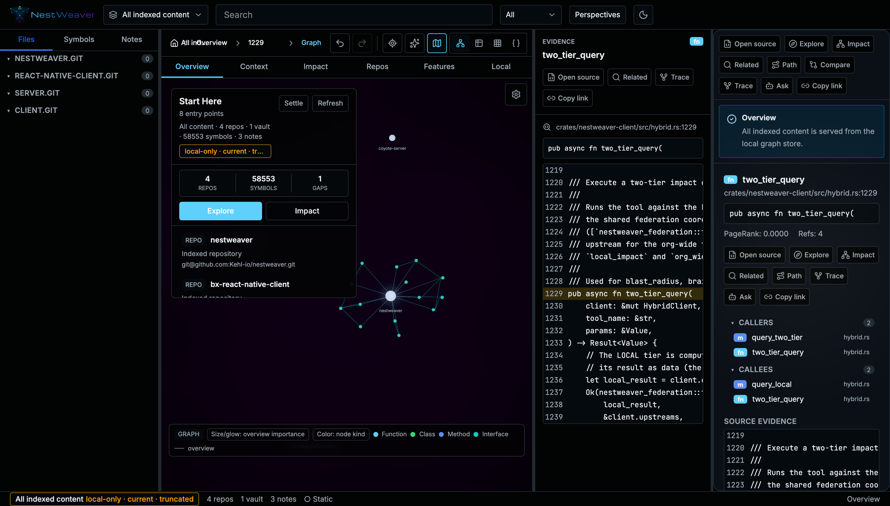
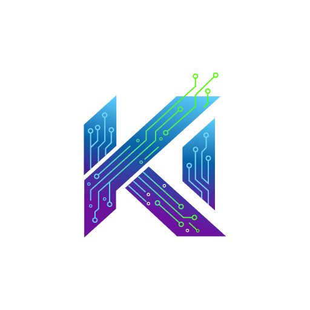

<p align="center">
  <picture>
    <source media="(prefers-color-scheme: dark)" srcset="assets/logo-full-dark.svg">
    <source media="(prefers-color-scheme: light)" srcset="assets/logo-full-light.svg">
    
  </picture>
</p>

<p align="center">
  <strong>Your codebase as a queryable graph — built for AI agents.</strong>
</p>

<p align="center">
  <a href="https://github.com/Kehl-io/nestweaver/actions/workflows/ci.yml"></a>
  <a href="https://github.com/Kehl-io/nestweaver/blob/main/LICENSE"></a>
  <a href="https://github.com/Kehl-io/nestweaver/releases"></a>
  
</p>

<p align="center">
  <a href="https://nestweaver.kehl.io">Website</a> · <a href="https://docs.nestweaver.kehl.io">Docs</a> · <a href="https://github.com/Kehl-io/nestweaver/releases">Releases</a>
</p>

<p align="center">
  NestWeaver parses 32 languages, resolves cross-file references with confidence scoring,<br>
  and gives agents precomputed answers about symbols, dependencies, call graphs,<br>
  type usage, and field access — no source reading required.
</p>

---

<p align="center">
  
</p>

<p align="center"><em>Index a repo and query it in seconds</em></p>

---

<table>
<tr>
<td width="50%" valign="top">

**32 Languages**<br>
Tree-sitter parsing for JS, TS, Go, Python, Rust, Java, C/C++, Lua, Scala, Elixir, Zig, Vue, Svelte, and 19 more. Tracks CALLS, IMPORTS, USES, and ACCESSES edges. Resolves monorepo workspaces and tsconfig path aliases.

</td>
<td width="50%" valign="top">

**Markdown Brain**<br>
Index Obsidian vaults alongside code. Unified knowledge graph across notes and symbols.

</td>
</tr>
<tr>
<td width="50%" valign="top">

**Intent-Aware Context**<br>
Personalized PageRank with per-edge-type weights (CALLS, IMPORTS, USES, ACCESSES) and `--intent` tuning surfaces exactly the symbols relevant to your task.

</td>
<td width="50%" valign="top">

**40-Tool MCP Server**<br>
Model Context Protocol tools for AI agents. Drop-in for any MCP client, lite mode for Cursor. Daemon architecture enables concurrent access from multiple AI tools without lock contention.

</td>
</tr>
<tr>
<td width="50%" valign="top">

**PR Impact & Dead Code**<br>
Confidence-weighted blast radius with `impact_score` decay through edges; co-change mining from git history (Jaccard-scored file pairs); type-aware call resolution via AST-extracted type bindings; dead code detection with type exclusion and manifest-driven entry points; hub/bridge analysis and graph export.

</td>
<td width="50%" valign="top">

**16 AI Tool Integrations**<br>
One-command setup for Claude Code, Cursor, Codex, Gemini CLI, Copilot CLI, Aider, Kiro, and more. Also offered automatically on the first interactive in-repo `index`.

</td>
</tr>
<tr>
<td width="50%" valign="top">

**Agent Interaction Memory**<br>
Opt-in usage tracking that learns from agent query patterns to improve PPR ranking over time. Privacy-first: local-only, records UIDs and timestamps only, no content capture. Enable with `--track-interactions`.

</td>
<td width="50%" valign="top">
</td>
</tr>
</table>

## Quick Start

```sh
# From a source checkout (requires Rust 1.85+)
cargo install --locked --path .

# Index a repository (auto-detects repo root from .git)
nestweaver index

# Get task-focused context for a symbol
nestweaver context processPayment

# Live re-indexing as you code
nestweaver watch
```

```sh
# Configure for your AI tool (16 supported: Claude Code, Cursor, Codex, Gemini CLI, and more)
nestweaver setup
nestweaver setup --force   # regenerate skill/guide files even if customized
```

> Running `nestweaver index` interactively from inside your repo also offers to
> configure your AI tools on the first index (skipped in CI, scripts, and
> non-TTY runs; force it with `nestweaver index --setup`). Config files are
> always written to the repo root.

Run `nestweaver --help` for the full command list. Most commands support `--json` for machine-readable output.

## Server Mode

NestWeaver can run as a centralized server, indexing repos for your entire team and serving queries to AI agents via gRPC and MCP-over-HTTP.

### Quick Start

```bash
# Start the server (TLS required for grpcs:// clients)
nestweaver daemon --db ./brain.lbug run \
  --server \
  --bind 0.0.0.0:9378 \
  --tls-cert ./tls/server.pem \
  --tls-key ./tls/server-key.pem \
  --auth-token "$NESTWEAVER_AUTH_TOKEN"

# Connect from another machine
nestweaver connect grpcs://nestweaver.internal:9378 --token "$NESTWEAVER_AUTH_TOKEN"
```

### Ports

| Port | Protocol | Purpose |
|------|----------|---------|
| 3000 | HTTP | Web UI (optional, `nestweaver ui`; 9377 in the macOS .app) |
| 9378 | gRPC | Query API (TCP + TLS) |
| 9379 | HTTP | MCP-over-HTTP (AI agents) + `/webhook` + `/admin/api/*` + Prometheus `/metrics` |

In server mode the daemon serves Prometheus `/metrics` on the MCP HTTP port (9379) — gRPC port + 1, inheriting the `--bind` IP. The same metrics are also exposed on 9377 when the web UI is running (`nestweaver ui`).

### Docker

```bash
docker compose up -d
```

See [Server Mode Guide](docs/server-mode.md) for full documentation.

## Install

### macOS app (source build)

The native **NestWeaver.app** is source-build-only until a release job publishes
a `.app` bundle or DMG. Build it from source (it bundles Metal-accelerated
embeddings and the web UI):

```sh
bash app/build.sh
open target/release/NestWeaver.app
```

The `.app` bundle gives you a menubar status icon, Metal GPU acceleration (~5x faster embeddings via a launchd-managed daemon), a persistent daemon shared with the CLI/MCP, web UI on port 9377, and launchd-managed restart. See [macOS App](#macos-app) below.

### All platforms (CLI)

The primary pre-built installation path is a GitHub Release archive. Select the
archive for your platform, verify its matching SHA-256 file, then install it as
described in [INSTALL.md](INSTALL.md#pre-built-cli-recommended). Starting with
the release that contains this change, both macOS CLI archives are built with
Metal support. The default `accelerator = "auto"` therefore requires Metal in
those builds and reports a Metal initialization or inference-probe failure
instead of retrying on CPU. To opt out explicitly, set `accelerator = "cpu"` in
the `[embedding]` section of your instance configuration. Builds without Metal
support select CPU for `auto`.

| Platform | Release target |
| --- | --- |
| Linux x86_64 | `x86_64-unknown-linux-gnu` |
| Linux aarch64 | `aarch64-unknown-linux-gnu` |
| macOS Intel | `x86_64-apple-darwin` |
| macOS Apple Silicon | `aarch64-apple-darwin` |

```sh
# After cloning the source repository (Rust 1.85+)
cargo install --locked --path .
```

Source builds also require CMake, a C++20 compiler, OpenSSL and zstd
development files, `pkg-config`, and Protocol Buffers. The checkout builds
LadybugDB from source rather than downloading a prebuilt archive; keep
`.cargo/config.toml` intact. See
[the source-build prerequisites](INSTALL.md#build-from-source) before
building.

<details>
<summary>Pre-built binaries</summary>

Download a pre-built CLI archive and its matching `.sha256` file from [GitHub Releases](https://github.com/Kehl-io/nestweaver/releases). Binaries are available for Linux and macOS on both x86_64 and aarch64; use the target table above and follow the checksum verification in [INSTALL.md](INSTALL.md#pre-built-cli-recommended).

</details>

<details>
<summary>Build from source</summary>

```sh
git clone https://github.com/Kehl-io/nestweaver.git
cd nestweaver
cargo install --locked --path .
# On macOS with Metal embeddings:
# cargo install --locked --path . --features metal
```

The first build compiles LadybugDB from source and may take several minutes.

</details>

## CLI Reference

<details>
<summary>Core Commands</summary>

| Command | Description |
|---------|-------------|
| `index` | Parse and index a repository (auto-detects repo root from `.git`). Use `--name` to set a custom repo name for multi-repo setups. |
| `watch` | Live re-indexing via filesystem watcher with debouncing. Runs daemon-side (no instance config required; unsafe roots are denylisted); `--force` replaces an existing watcher. Incremental reindex preserves CALLS/IMPORTS edges (reverse dependents are re-resolved) and reports per-file failures instead of dying |
| `context` | Get task-focused context via PPR (supports `--intent` for tuned retrieval) |
| `search` | Full-text search across indexed symbols and notes |
| `symbol` | Look up a symbol by name and display its metadata |
| `impact` | Trace the blast radius of a symbol through the dependency graph (fails closed on unknown/foreign UIDs, exit 2; `--depth` 1–15; pruning by impact-score threshold or depth is disclosed, `--min-score 0` opts out) |
| `blast-radius` | Assess blast radius for a set of changed files; reports `gate_state`/`status` and blind spots, and never reports `ok` for a truncated traversal |
| `flow-trace` | Trace forward execution flow from a symbol — what it calls, and what those call |
| `read-symbols` | Read a symbol's source span |
| `regex-search` | Regex search over indexed text (trigram pre-filter; falls back to a full scan with `stale_index: true` when the trigram index is stale — re-run `index --with-trigrams`) |
| `count-patterns` | Count regex matches per pattern |
| `investigate` | Orient on a topic in one call |
| `investigate-expand` | Drill into investigate bundle entries — full body plus immediate neighbours |
| `investigate-hydrate` | Fill in bodies/summaries for all un-hydrated entries of a bundle |
| `affected-tests` | Select tests for changed files (tiered; carries a `recommendation` CI directive — `run-full-suite` on any degraded run or when changed files have unrecognized extensions like Makefile/CI YAML/`.sql`) |
| `repo-map` | Generate a token-budgeted map of the repository structure |
| `summary` | Hierarchical code summaries at symbol, file, or cluster level |

</details>

<details>
<summary>Brain Commands</summary>

| Command | Description |
|---------|-------------|
| `brain add` | Add an Obsidian vault or markdown directory to the knowledge graph |
| `brain search` | Search across code symbols, notes, headings, sections, and tags (`--limit` 1–1000) |
| `brain context` | Get unified context spanning both code symbols and notes (skips the semantic leg entirely when the DB has no embeddings; identical concurrent calls coalesce single-flight) |
| `brain list` | List all registered vaults |
| `brain status` | Show vault counts, per-vault staleness, and index health |
| `brain watch` | Watch vaults for changes and re-index automatically |
| `brain refresh` | Force re-index of all registered vaults |
| `brain remove` | Remove a vault from the brain (cascade-deletes nodes; does not touch files on disk) |
| `brain stale-check` | Check if the indexed graph is stale by comparing each repo's indexed SHA against git HEAD (also available top-level as `stale-check`). Exits 1 when any repo is stale or its working tree is missing (`[missing]`) — usable as a CI freshness gate |
| `brain reindex-search` | Rebuild the Tantivy BM25 search index from current graph state |
| `brain broken-links` | List wikilinks with ambiguous or low-confidence targets, with suggested fixes |
| `brain orphans` | List notes with zero inbound and zero outbound wikilinks |
| `brain topic-clusters` | Detect topic clusters via Louvain-style local-moving community detection over note wikilinks |
| `brain tag-graph` | Show a tag's note count and co-occurring tags (or dump the full tag graph) |
| `brain doc-stats` | One-shot health summary: note/wikilink counts, broken links, orphans, top tags |
| `memory lint` | Health checks over the vault (stale notes, broken links, orphans) |
| `memory consolidate` | Propose/apply tier promotions (logs → ideas → project files) |
| `memory related` | Typed-edge traversal from a note (supersedes, depends-on, etc.) |

</details>

<details>
<summary>Analysis Commands</summary>

| Command | Description |
|---------|-------------|
| `hubs` | Find most connected hub nodes (degree centrality + PageRank) |
| `bridges` | Find architectural chokepoints (betweenness centrality) |
| `pr-impact` | PR blast radius analysis with risk scoring (Low/Medium/High); `--sarif` for code scanning, `--strict` to gate on contract-verified breaking changes |
| `rts-eval record-truth` | Report a full-suite outcome from CI so selection quality can be measured |
| `rts-eval report` | Measured file-recall / change-recall / selection-breadth of past selections (refuses percentages below 10 joined runs) |
| `dead-code` | Detect unreachable symbols via entry point reachability (`unreachable_count` is the unfiltered total; `matching_count` reflects `--min-confidence`; Rust `pub mod` Modules are never flagged; visibility isn't persisted, so all confidence scores are inferred/Medium) |
| `rerank` | Lightweight result reranker (off-by-default heuristic) |
| `info` | Show hardware and configuration information |
| `contracts list` | List API contracts derived from spec files + framework handlers |
| `contracts drift` | Routes declared in a spec but not implemented, and vice versa (presence-level) |
| `contracts diff` | Field/type-level OpenAPI breaking-change diff between two spec versions (`--base`/`--head`, `--fail-on-breaking` for CI) |
| `ranking` | Inspect ranking priors |
| `eval` | Offline retrieval-quality evaluation |
| `export` | Export the graph in Cypher, GraphML, Mermaid, or MessagePack format (cypher/graphml/mermaid carry real PageRank scores; mermaid `--top N` ranks by PageRank; msgpack always writes to `--output`/`<db>.graph.msgpack`, never stdout) |

</details>

<details>
<summary>Multi-Repo and Projects</summary>

| Command | Description |
|---------|-------------|
| `list-projects` | List all projects defined in the instance config |
| `project-context` | Get context scoped to a specific project |
| `materialize-projects` | Materialize declared projects, wiki sources, and cross-repo links from instance config |
| `detect-implicit-projects` | Detect implicit projects from vault structure and code patterns |
| `suggest-links` | Discover potential cross-repo links between symbols |
| `list-links` | List all cross-repo links in the instance |
| `list-features` | List features spanning multiple repositories |
| `clusters` | Detect community clusters in the dependency graph (Louvain-style local moving, single-level; results cached in a sidecar, `cluster <id\|name>` reads the cache) |
| `cross-repo-refs` | Find references that cross repository boundaries |

</details>

<details>
<summary>Server and Admin</summary>

| Command | Description |
|---------|-------------|
| `mcp` | Start the MCP server (40 tools, or 6 in lite mode; auto-starts daemon) |
| `daemon` | Manage the background daemon (`start`, `stop`, `status`, `restart`; `run --server` for server mode) |
| `connect` | Connect to an upstream NestWeaver server (federated read/impact) |
| `server` | Server management utilities (`init-tls`, `backup`, `status`) |
| `ui` | Launch the interactive web UI |
| `setup` | Auto-detect and configure AI tools (16 supported). Use `--force` to regenerate customized files |
| `generate-guide` | Generate tool-specific instruction files (skill, cursor-rule, agents-md, claude-md) |
| `completions` | Generate shell completions (bash, zsh, fish, powershell) |
| `embed` | Generate vector embeddings for symbols, notes, and headings using a local model (Metal-accelerated) or external API. Reports an eligibility plan before embedding and exits successfully without loading the model when nothing is eligible; `--force` re-embeds everything |
| `pull` | Pull a snapshot from a remote storage backend |
| `config validate` | Validate an instance config without creating files or contacting services (`--json` for a machine-readable result) |
| `diagnostics capabilities` | Report embedding and Metal compile/runtime capabilities, including whether Metal was selected or fell back (`--json`) |
| `instance` | Manage instance configuration. `abort-migration` clears a wedged migration journal so the daemon can boot |
| `snapshot` | Manage graph snapshots (build, verify, push) |
| `backup` | Backup and restore the NestWeaver database |
| `list-repos` | List all indexed repositories |
| `remove-repo` | Remove an indexed repository and all its data (symbols, files, services, contracts) from the graph |
| `remove-project` | Remove a materialized project and its edges from the graph |
| `prune-stale` | Remove repos and vaults whose source directories no longer exist on disk |
| `list-services` | List all detected services |
| `service-summary` | Display a summary of a specific service |
| `admin` | Subagent guidance instructions |
| `interactions` | Manage interaction memory |
| `hooks` | Install/remove the local pre-push blast-radius check (`--install`, `--strict`, `--uninstall`) |
| `pre-push-impact` | Analyse local changes against the org-wide graph — what `hooks` runs, and runnable directly (alias `ppi`) |
| `format-comment` | Format impact analysis results as a PR/MR comment, for CI to post |

</details>

### Local pre-push check

Get "confidence before you push" from the same hardened blast-radius analysis CI runs — locally, on your machine:

```sh
nestweaver hooks --install
```

This writes a `.git/hooks/pre-push` that runs `nestweaver pr-impact` against the merge-base before every push. It is **advisory by default**: it **never blocks** your push (fail-open), stays **silent on a trivial change**, and prints a concise banner — the gate verdict, the top affected symbols, and a coverage caveat when the analysis was incomplete — only when there's something to review. A degraded/incomplete run never blocks, because an incomplete traversal can't be trusted to have found the risk.

To make it block a push (exit 2) on a **contract-verified breaking change** — a decidable API-signature break, not a heuristic:

```sh
nestweaver hooks --install --strict
```

What `--strict` blocks on is configurable via the `[pr_impact]` section of `nestweaver-instance.toml` (`strict_block_on_breaking`, default `true`; `strict_block_on_high_risk`, default `false` — opt in to also block on a complete High-risk run). A degraded/incomplete run is never blocked on risk.

Remove it (restoring any hook it backed up) with:

```sh
nestweaver hooks --uninstall
```

You can also run the check manually — this is exactly what the hook does:

```sh
nestweaver pr-impact --base origin/main            # advisory banner
nestweaver pr-impact --base origin/main --strict   # exit 2 on a contract-verified breaking change (default policy)
```

## Features

<details>
<summary>Markdown Brain</summary>

Index Obsidian vaults and markdown directories alongside your code. NestWeaver builds a unified knowledge graph that connects notes, sections, and tags to code symbols — letting you query across both worlds. Wiki/HTML content is auto-converted to markdown during ingestion. Use `.brainignore` for glob exclusion patterns or `--ignore` for ad-hoc filtering.

```sh
# Add a vault to the knowledge graph
nestweaver brain add ~/Documents/Obsidian/MyVault

# Search across code symbols and vault notes
nestweaver brain search "architecture"

# Get unified context spanning code and notes
nestweaver brain context "MyProject"
```

</details>

<details>
<summary>Semantic Search (Embedding Seed Layer)</summary>

Query with natural language — no need to know exact symbol names. NestWeaver
embeds symbols, notes, and headings using the configured local or external
backend, then uses semantic similarity to find entry points for the graph walk.
Backend and device selection are explicit: failures are reported and never
switch to another backend or device.

```sh
# Embed all indexed content (one-time, incremental after)
nestweaver embed --stats

# Natural language queries just work
nestweaver context "how does authentication work"
nestweaver context "BLE bluetooth connection handling"
nestweaver context "where does the upload pipeline start"
```

Three retrieval signals are fused via Convex Combination: PPR (graph
structure), BM25 (text match), and semantic (embedding similarity).

**Device policy.**

| `accelerator` | Local-backend behavior |
| --- | --- |
| `auto` | Metal in a Metal-enabled build; CPU only when Metal is not compiled. A Metal failure is reported; `auto` does not retry on CPU. |
| `metal` | Requires Metal to be compiled and the device plus full model inference probe to succeed; otherwise embedding state is `failed`. |
| `cpu` | Selects CPU directly and never probes Metal. |

**Model selection and cache.** The default is the light, fast
`sentence-transformers/all-MiniLM-L6-v2` (384-dim, ~90MB) — a good fit for most
repos and CPU-only servers. NestWeaver records the model used for each database,
and the daemon loads that recorded model to avoid dimension mismatches. Daemon
startup is cache-only: it never downloads model files or contacts Hugging Face.
The configured `cache_dir` expands a leading `~/` against the daemon user's home
directory.

If the model is absent, stop the daemon and use the direct local path, which may
download missing artifacts. The required form is
`nestweaver embed --db <path> --local --model-id <id> --cache-dir <path>`.
Use the same model ID and expanded cache directory configured for the daemon:

```sh
CONFIG=/absolute/path/to/nestweaver-instance.toml
DB=/absolute/path/to/brain.lbug
MODEL=sentence-transformers/all-MiniLM-L6-v2
CACHE="$HOME/.cache/nestweaver/models"
nestweaver daemon --db "$DB" stop
nestweaver embed --db "$DB" --local --model-id "$MODEL" --cache-dir "$CACHE"
nestweaver daemon --db "$DB" start --config "$CONFIG"
```

**External embedding endpoints.** Instead of a local model you can embed via an
OpenAI-compatible endpoint:
`nestweaver embed --endpoint http://localhost:11434 --model nomic-embed-text`
(Ollama), or a hosted gateway. For keyed gateways (OpenAI, Azure), set
`NESTWEAVER_EMBED_API_KEY` — it is sent as a bearer token and is never written
to config, the graph, or a snapshot. An external endpoint is authoritative: a
load or request failure is reported and does not load a local model. Switching
backends requires both an explicit configuration change and re-embedding:
remove `external_endpoint`, stop the daemon, and replace the recorded external
model metadata/vectors with the chosen local model:

```sh
CONFIG=/absolute/path/to/nestweaver-instance.toml
DB=/absolute/path/to/brain.lbug
MODEL=sentence-transformers/all-MiniLM-L6-v2
CACHE="$HOME/.cache/nestweaver/models"
nestweaver daemon --db "$DB" stop
nestweaver embed --db "$DB" --local --model-id "$MODEL" --cache-dir "$CACHE" --force
nestweaver daemon --db "$DB" start --config "$CONFIG"
```

NestWeaver records the index dimension and rejects mismatched vectors, so any
model/backend switch requires `--force`. The direct path
(`--endpoint`/`--local`) cannot run while a daemon holds the DB write lock; stop
that daemon first or, when the configured daemon backend is already ready, drop
both direct-path flags.

**Stopping.** `nestweaver daemon stop` drains in-flight writes with every
listener still up, so reads keep working while it drains (individual reads can
still stall for seconds while a write commits), and an idle daemon exits
immediately. New writes are refused with `UNAVAILABLE` once shutdown starts, so
the drain always finishes. It never SIGKILLs on its own — if a write is still
running it reports what it observed and leaves the daemon up; `daemon stop
--force` or `kill -9` end it anyway, abandoning that write. Under a process supervisor (systemd
`TimeoutStopSec`, launchd `ExitTimeOut`, Docker `stop_grace_period`) the
supervisor's own timer still applies. See the
[Daemon Shutdown Guide](docs/guide/daemon-shutdown.md).

**Readiness and diagnostics.** On macOS, background start/autostart uses launchd
to own a foreground daemon process; `daemon run` stays in the invoking
foreground. Neither path forks or self-daemonizes. Readiness is published only
after a real embedding inference succeeds. Inspect compile/runtime capability
and the selected backend with:

```sh
nestweaver diagnostics capabilities --json
nestweaver daemon --db <path> status
nestweaver brain status --db <path> --json
```

The status reports `requested_device`, `selected_device`, and `fallback_used`.
A local backend is ready only when `selected_device` is `metal` or `cpu` and
`fallback_used` is `false`; an external backend has no local selected device.
When semantic retrieval was requested but unavailable, context responses keep
the graph/PPR/BM25 result and report `"semantic"` in `degraded_components`
(the only value in that vocabulary today). Caveat: the hybrid/federated merge
for `brain_context` / `project_context` rebuilds the `connected` response shape
and currently drops both `semantic_applied` and `degraded_components`, so a
merged two-tier context answer does not carry them. The direct, daemon, and
`brain_search` paths do.

**Performance:** 7ms query embedding (Metal), 37ms (CPU) for all-MiniLM;
heavier models trade speed for quality. Forward Push PPR replaces power
iteration for sub-10ms graph walks. LRU cache makes repeated queries instant
(~8ms).

Configure the model and fusion weights in `instance.toml`:
```toml
[embedding]
# Shipped default; the model a DB was actually embedded with is recorded and
# auto-loaded by the daemon. Set this to override the default for fresh instances.
model_id = "sentence-transformers/all-MiniLM-L6-v2"
# cache_dir defaults to the platform-native cache directory:
# ~/Library/Caches/nestweaver/models on macOS, $XDG_CACHE_HOME/nestweaver/models
# (or ~/.cache/nestweaver/models) on Linux. Explicit values may use ~/.
# If unavailable or non-UTF-8, a UTF-8 HOME uses ~/.cache first. The final
# fallback is /var/cache/nestweaver/models on Unix or C:\ProgramData\nestweaver\models
# on Windows; set cache_dir explicitly if that system location is not writable.
# cache_dir = "~/Library/Caches/nestweaver/models"
accelerator = "auto" # auto | metal | cpu; see the policy table above
weight_ppr = 0.40
weight_bm25 = 0.25
weight_semantic = 0.35
```

</details>

<details>
<summary>macOS App</summary>

NestWeaver can build a native macOS `.app` bundle from source. No release
`.app` bundle or DMG is currently published. A source build provides:

- **Menubar status icon** with quick access to the web UI and daemon status
- **Metal GPU acceleration** — the app launches the daemon as a non-forking launchd Aqua agent, then the daemon proves full model inference before reporting the Metal backend ready (~5x faster: 7ms vs 37ms).
- **Managed daemon lifecycle** — launches the daemon via launchd (which owns crash-restart); the daemon is a shared service (MCP/CLI/UI all use it) and persists across app quits, so the app re-attaches to it on next launch
- **Daemon coexistence** — detects if a daemon is already running (via CLI or launchd) and connects to it instead of starting a second instance
- **Web UI** at `http://127.0.0.1:9377` — opens automatically on launch

```sh
# Build from source (requires Xcode Command Line Tools)
bash app/build.sh
open target/release/NestWeaver.app
```

The app is menubar-only (no Dock icon). Click the NestWeaver icon in the menubar to open the web UI or quit. Database is auto-detected from `NESTWEAVER_DB`, `~/.nestweaver/instance.toml`, or `~/.local/share/nestweaver/*/brain.lbug`.

**When to use the app vs CLI:**
- Use the **app** for always-on daemon with Metal GPU, menubar access, and the web UI
- Use the **CLI** (`nestweaver daemon start`) for headless/server environments, CI, or if you prefer terminal-only workflows

</details>

<details>
<summary>Projects</summary>

Group repositories, features, and configuration into named projects using TOML config files. Projects scope queries and context to just the code that matters.

```toml
# nestweaver-instance.toml
[[projects]]
name = "payments"
repos = ["payments-api", "payments-worker"]
components = ["checkout", "refunds"]
```

```sh
nestweaver project-context "payments" --token-budget 5000
```

</details>

<details>
<summary>Multi-Repo and Instance Config</summary>

Manage multiple repositories as a single graph. NestWeaver discovers cross-repo dependencies, suggests links between related symbols, and lets you query across repository boundaries.

See the [Instance Config Guide](docs/guide/instance-config.md) for full configuration options. If an older database mixes instance_id conventions, the [Instance ID Migration Runbook](docs/guide/instance-id-migration.md) consolidates it.

```sh
# Discover cross-repo links
nestweaver suggest-links --db ./all.lbug

# Get context for a feature spanning multiple repos
nestweaver context --feature device-pairing --config ./nestweaver-instance.toml --db ./all.lbug
```

**Runtime-configurable defaults** — set `[limits]` in your instance config to override the built-in pagination default (50) for all MCP tools and CLI commands:

```toml
[limits]
default_result_limit = 100
```

CLI commands (`search`, `brain search`, `brain context`) also respect this setting when `--limit` is not explicitly passed. The `[response]` section controls inline body thresholds.

</details>

## MCP Server

NestWeaver exposes 40 tools via the [Model Context Protocol](https://modelcontextprotocol.io), giving any MCP-compatible AI agent structured access to your codebase graph without reading source files directly.

```sh
nestweaver mcp --db ./nestweaver.lbug
nestweaver mcp --tools brain_context,brain_search,read_symbols --db ./nestweaver.lbug   # allowlist specific tools
NESTWEAVER_NO_DAEMON=1 nestweaver mcp --no-daemon --db ./nestweaver.lbug   # read-only direct mode (CI/testing)
```

Direct mode advertises 35 read-only tools and rejects mutations before
dispatch. Daemon-backed stdio exposes all 40 tools. `--tools` names are exact,
case-sensitive registry names; unknown, duplicate, empty, or transport-
unavailable names fail at startup instead of silently producing an empty tool
surface.

The MCP server automatically starts a background daemon that owns the database. Multiple MCP servers, CLI commands, and IDE integrations can share the same database concurrently without lock contention. The daemon exits after 1 hour of inactivity.

```sh
nestweaver daemon status --db ./nestweaver.lbug   # check daemon state
nestweaver daemon stop --db ./nestweaver.lbug     # stop the daemon manually
pgrep -af "nestweaver daemon"                     # find running daemons (Linux)
```

40 tools including type-aware context retrieval, confidence-weighted impact analysis (`impact_score` shows how strongly changes propagate), investigation bundles, co-change detection, dead code analysis, community detection, and vault/notes integration. Use `--tools` to expose only the tools you need. The `--tools`/`--lite` allowlists are enforced on every transport (local stdio, daemon proxy, hybrid, and MCP-over-HTTP), and tool schemas validate their arguments — numeric bounds (e.g. `token_budget` 1–16000, `depth`/`max_depth` 1–15) are enforced and unknown argument names are rejected instead of silently ignored.

### Key capabilities

- **Type-aware call resolution** — AST-extracted type bindings (annotations, constructors, self/this, return types) resolve `obj.method()` calls to the correct target class
- **Confidence-weighted blast radius** — `impact_score` decays multiplicatively through edges; low-confidence paths are pruned
- **Co-change mining** — Jaccard-scored file pairs from git history surface files that always change together
- **MRO walk** — inherited methods resolved via class hierarchy traversal (depth 5, cycle-safe)

External MCP servers can be configured in your instance config with `timeout_secs` (default 30):

```toml
[[mcp_servers]]
name = "wiki-mcp"
command = "wiki-mcp"
timeout_secs = 60
```

## Web UI

A search-first, task-lens workspace over your code+notes graph, powered by Three.js/React-Three-Fiber. The landing view is a **repo-galaxy constellation** — one luminous cluster per repository — rendered dark-first with selective HDR bloom, in-scene SDF labels, and a procedural nebula backdrop. Everything encodes meaning: color = kind, size = importance, and Spark-green convergence rings mark betweenness bridges (architectural chokepoints).

```sh
nestweaver ui --db ./nestweaver.lbug --port 8080
nestweaver ui --db ./nestweaver.lbug --port 8080 --watch  # live re-indexing
```

<p align="center">
  
</p>
<p align="center">
  
</p>

**Work by task, not by graph theory:**
- **Workspace scope** — switch between all indexed content, a single repo, or a vault; every view carries an honest trust chip (local-only / federated, current / stale, partial / truncated)
- **Command bar (`⌘K`) + Search Phrases** — plain-language queries resolve to typed scenes deterministically: `impact of <symbol>`, `trace flow from <symbol>`, `callers of <symbol>`, `path from <A> to <B>`, `notes about <topic>`, `backlinks for <note>`, `hubs in <repo>`, `dead code in <repo>`, `stale repos`
- **Task lenses** — Overview, Context, Impact (layered blast-radius DAG with affected tests and local/org trust states), Trace (execution stepper), Repos, Features, Local neighborhood
- **Tri-panel workspace** — activating a node opens a focused graph, synced source/note evidence, and a knowledge card (identity, role, evidence, relationships, trust, next actions), cross-highlighted
- **Graph / table / JSON parity** — every result set is inspectable as a graph, an accessible table, or raw JSON with provenance/trust `_meta`
- **Deep links** restore workspace scope, selected node, active lens, and representation mode

**Visual & motion** (all gated behind `prefers-reduced-motion`, which the UI auto-detects):
- Selective HDR bloom via Khronos PBR-Neutral tone mapping — loud only on focus, hubs, and bridges; the ambient field stays calm
- In-scene SDF text labels with collision-aware placement (labels never overlap nodes) and a landmark hierarchy that reveals detail on zoom
- Per-galaxy glowing edge web, hub coronas, and settle-and-freeze force layout that preserves spatial memory across re-indexing
- Signature moments: repo-galaxy ignition on load and a focus impact-ripple that traces blast radius
- Community overlay (Louvain), minimap, and an explicit System / Light / Dark theme control

**Accessibility:** all six task journeys have a keyboard-only path; reduced-motion preserves every static meaning channel; graph answers always have a table/JSON equivalent; a screen-reader landmark summary mirrors the canvas.

**WASM mode** — Append `?engine=wasm` to the URL to run graph algorithms client-side via WebAssembly. The browser downloads a MessagePack snapshot and executes PPR locally — no server round-trips for queries. Requires building the wasm first (use `--remap-path-prefix` so the build
machine's home path isn't baked into the artifact):
`RUSTFLAGS="--remap-path-prefix=$HOME=/build" wasm-pack build crates/nestweaver-wasm --target web --out-dir ../../crates/nestweaver-web/frontend/src/wasm`.

**Keyboard shortcuts** (press `?` in the UI for the full list):
- `1`–`6` — switch task mode (Overview, Context, Impact, Repos, Features, Local)
- `⌘K` — open the ask / Search-Phrase command bar · `/` — focus search
- `⌘L` — cycle graph / list / matrix representation · `⌘⇧G` — toggle zen (canvas-only) layout
- `I` — impact of selected · `P` — path from selected · `M` / `C` / `T` — minimap / communities / tags
- `⌘Z` / `⌘⇧Z` — navigate history back / forward · `Esc` — clear selection

## Architecture

<details>
<summary>Cargo workspace with 15 crates compiling to a single static binary + optional WASM module</summary>

| Crate | Description |
|-------|-------------|
| `nestweaver-schema` | Node/edge types, UIDs, confidence scoring, schema versioning |
| `nestweaver-parser` | Tree-sitter + regex parsing for 32 languages |
| `nestweaver-resolver` | Cross-file symbol resolution with import graphs, monorepo workspace packages, and tsconfig path aliases |
| `nestweaver-store` | LadybugDB graph store, PageRank, hybrid search |
| `nestweaver-storage` | Pluggable snapshot storage backends (local, S3, GitLab) |
| `nestweaver-engine` | Indexing pipeline, query dispatch, config, snapshots, LLM integration |
| `nestweaver-algorithms` | Pure-compute graph algorithms (PPR, impact BFS) — WASM-compatible, no I/O |
| `nestweaver-embed` | Local embedding models (candle; Metal GPU on macOS) for vector search |
| `nestweaver-proto` | gRPC service definition (protobuf) for daemon IPC |
| `nestweaver-federation` | Federation coordinator — upstream routing, health/ejection, two-tier merge, staleness (leaf; used by client + daemon-mode mcp) |
| `nestweaver-daemon` | Background daemon — owns the database, serves gRPC over Unix socket |
| `nestweaver-client` | Daemon client with auto-start, flock-based race prevention, version check |
| `nestweaver-mcp` | MCP server — proxies tool calls through the daemon |
| `nestweaver-web` | Web UI (Three.js/R3F) and Axum API backend |
| `nestweaver-wasm` | Browser-side WASM module wrapping nestweaver-algorithms |

```
schema              (zero internal deps)
  <- parser
  <- resolver
  <- store
algorithms          (zero internal deps — WASM target)
  <- wasm
storage             (zero internal deps)
proto               (generated gRPC types)
federation          (leaf: schema + proto — upstream routing/merge/staleness)
       <- engine <- (parser, resolver, store, storage, algorithms)
            <- daemon <- (engine, store, mcp, proto)
            <- client <- (proto, daemon, federation)
            <- mcp    <- (engine, store, schema; proto + federation under the `daemon` feature)
            <- web
```

</details>

## Performance

<table>
<tr>
<td width="50%" valign="top">

**71ms** query p50<br>
Next.js — 29,402 files

</td>
<td width="50%" valign="top">

**632ms** incremental re-index<br>
Tailwind CSS — no full rebuild needed

</td>
</tr>
<tr>
<td width="50%" valign="top">

**14.8M** edges extracted<br>
Elasticsearch — 511K symbols, 43K files

</td>
<td width="50%" valign="top">
</td>
</tr>
</table>

<details>
<summary>Benchmark results (NestWeaver vs Graphify)</summary>

**Query Speed (p50)**

| Repository | Files | NestWeaver | Graphify |
|---|---:|---:|---:|
| Tailwind CSS | 542 | **157ms** | 185ms |
| Deno | 14,136 | **82ms** | 1,355ms |
| Next.js | 29,402 | **71ms** | 2,440ms |
| Elasticsearch | 43,806 | **617ms** | crashed |

**Indexing Speed**

| Repository | NestWeaver | Graphify |
|---|---:|---:|
| Tailwind CSS | 3.6s | 2.5s |
| Deno | 51s | 33s |
| Next.js | **33s** | 111s |
| Elasticsearch | **3,462s** | crashed |

**Incremental re-indexing** (NestWeaver only — Graphify requires full re-index): 632ms (Tailwind), 4.0s (Next.js), 73s (Elasticsearch).

**Graph depth**: NestWeaver extracts 142K symbols / 280K edges on Deno (vs Graphify's 76K / 177K). On Elasticsearch: 511K symbols, 14.8M edges.

**Result quality**: NestWeaver returns ~30 connected symbols per query ranked by PageRank with full signatures. Graphify returns file-level nodes with 9-15% garbage stubs.

*Benchmarked in daemon mode on M3 Pro (36 GB). See [benchmarks/](benchmarks/) to reproduce.*

</details>

## Contributing

See [CONTRIBUTING.md](CONTRIBUTING.md) for guidelines on building, testing, and submitting changes.

## License

[MIT](LICENSE)

---

<p align="center">
  <a href="https://kehl.io">
    
  </a>
  <br>
  <sub>Built by <a href="https://kehl.io">kehl.io</a></sub>
</p>
